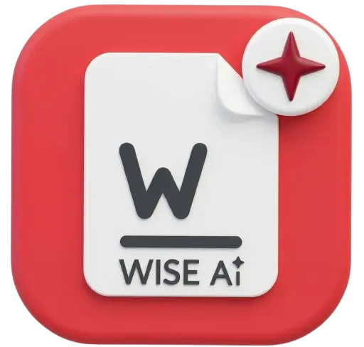

<div align="center">



<br />
<br />

<h3>
  
  &nbsp;
  
</h3>

# The Wise Cloud

**Two AI-powered products. One platform. Built for every side of the hiring table.**

[](https://react.dev/)
[](https://www.typescriptlang.org/)
[](https://vitejs.dev/)
[](https://supabase.com/)
[](https://tailwindcss.com/)
[](https://www.framer.com/motion/)
[](https://capacitorjs.com/)
[](https://kinde.com/)

**[🌐 Live App →](https://resume.thewise.cloud)**&nbsp;&nbsp;•&nbsp;&nbsp;
[WiseResume](#-wiseresume--ai-career-platform) &nbsp;•&nbsp;
[WiseHire](#-wisehire--ai-hr-saas) &nbsp;•&nbsp;
[Admin Dev Kit](#-admin-dev-kit) &nbsp;•&nbsp;
[Tech Stack](#-tech-stack) &nbsp;•&nbsp;
[Architecture](#-architecture) &nbsp;•&nbsp;
[Getting Started](#-getting-started) &nbsp;•&nbsp;
[Governance](#-governance)

</div>

---

## What is The Wise Cloud?

**The Wise Cloud** is a dual-product AI platform that serves both sides of the hiring market from a single codebase. **WiseResume** gives job seekers a complete AI career hub — resume builder, interview coach, portfolio, and 16+ AI tools. **WiseHire** gives HR teams and recruiters AI-powered screening, candidate briefs, a full hiring pipeline, and a searchable talent pool.

Both products share the same authentication (Kinde), database (Supabase PostgreSQL), AI infrastructure, edge functions, and admin tooling. They are permanently separated by a `profiles.account_type` flag (`job_seeker` | `hr`) set at sign-up. The landing page at `/` presents both products via a **"For Job Seekers" / "For Companies"** toggle.

---

## 🎯 WiseResume — AI Career Platform

> *The complete AI toolkit for job seekers, career changers, and high-volume applicants.*

<details open>
<summary><b>Resume Builder</b></summary>
<br>

- **30+ professional templates** with real-time live preview across all edits
- **Multi-section editor** with drag-and-drop reordering: Summary, Experience, Education, Skills, Projects, Certifications, Awards, Publications, Languages, Volunteering, and fully custom sections
- **Four export formats**: Standard PDF, ATS-optimized PDF, DOCX, and Plain Text
- **Template Advisor** — AI recommends the best template for your role and industry
- **Resume version history** — snapshot and restore any previous version at any time
- **ATS score analysis** — deterministic scoring against a job description (no AI credits, always instant)
- **Headshot generation** — AI-generated professional headshot integrated into your resume and profile

</details>

<details open>
<summary><b>In-Editor AI Tools</b></summary>
<br>

| Tool | What it does | Credits |
|------|-------------|---------|
| **AI Tailor** | Rewrites your entire resume to match a specific job description with ATS keyword injection | 2 |
| **Section Enhance** | Rewrites individual bullets and section copy for impact and clarity | 1 |
| **Gap Explainer** | Professionally frames employment gaps without sounding defensive | 1 |
| **One-Page Optimizer** | Trims content to fit a single page without losing key information | 1 |
| **ATS Analyzer** | Deep keyword and formatting analysis against a specific job posting | 1 |
| **Resume Parser** | Imports an existing PDF via AI extraction with OCR and regex fallbacks | 2 |
| **Resume from Text** | Converts freeform career notes into a structured, formatted resume | 2 |

</details>

<details open>
<summary><b>AI Studio — 20 Career Tools + Wise AI Chat</b></summary>
<br>

A dedicated workspace at `/ai-studio` with **20 career tools across 3 categories** plus the Wise AI Chat agentic assistant. QR Utilities are a separate free section on the same page and are not counted in the 20:

**Wise AI Chat** (pinned at the top)

A conversational career assistant that can **directly edit your resume** through agentic tool calls:

> Update summary · Add/update/delete experience · Update skills · Add skills · Update contact info · Add projects · Suggest edits · Proofread & fix

**Resume & Application** (8 tools)
| Tool | Description |
|------|-------------|
| Smart Tailor | Adapts your entire resume to match a specific job description with ATS keyword injection |
| Enhance | Rewrites individual bullets and sections for impact and clarity |
| 1-Page Wizard | Trims and condenses your resume to fit on a single page |
| Humanize | Detects AI-written text and rewrites it to sound natural |
| Job Match | ATS compatibility score against a specific job description |
| A/B Compare | Side-by-side score of two resume versions against the same job |
| Recruiter Sim | Simulates a recruiter reading your resume with commentary |
| Skills Gap | Maps your current skills against a target role's requirements |

**Career & Outreach** (6 tools)
| Tool | Description |
|------|-------------|
| Career Plan | AI career path advisor with skill gap suggestions and next steps |
| Interview Prep | Launches AI Interview Coach with job-description-specific questions |
| Company Briefing | Deep-dive company research before an interview — cached for 7 days |
| Salary Coach | Negotiation scripts, talking points, and counter-offer strategies |
| Cold Email | Outreach emails to recruiters and hiring managers |
| Rejection Analyzer | Turns rejections into learning moments with follow-up scripts |

**Personal Brand** (6 tools)
| Tool | Description |
|------|-------------|
| LinkedIn Optimizer | Rewrites your LinkedIn summary and headline for search visibility |
| Brand Statement | Generates 3 style variants of your professional brand statement |
| Portfolio Bio | AI-written bio tailored for your public portfolio page |
| Cover Letters | AI cover letter generator — persisted to your account |
| Resignation Letter | Professional resignation letters for any circumstance — persisted to your account |
| Reference Letter | Drafts a reference letter for a referee to send on your behalf |

**QR Utilities** (separate section)
| Tool | Description |
|------|-------------|
| QR Generator | Generate custom QR codes for your resume or portfolio URL |
| Batch QR | Bulk CSV → QR codes exported as a ZIP |
| QR Scanner | Decode a QR code from an uploaded image |

</details>

<details open>
<summary><b>AI Interview Coach</b></summary>
<br>

- **Voice + text mock interviews** — ElevenLabs Scribe for speech-to-text transcription; browser Web Speech API for reading questions aloud
- **Job-description-specific question banks** — questions tailored to the actual role you are applying for
- **AI recruiter simulation mode** — mimics real recruiter follow-up patterns
- **Real-time answer feedback** with scoring on clarity, relevance, and confidence
- **Full session transcripts** with a shareable performance report link
- **Interview reports** at `/interview/report/:id` — downloadable, shareable summary cards

</details>

<details open>
<summary><b>Public Portfolio Builder</b></summary>
<br>

- **Live portfolio** at `/p/:username` — converts your resume into a polished public page
- **9+ visual themes** with per-section visibility toggles
- **AI-generated portfolio bio** tailored to your resume and target audience
- **AI recruiter chat widget** — visitors ask the AI questions about you and get answers grounded in your actual experience
- **Portfolio analytics** — view counts, device types, and geographic breakdown (Premium)
- **OG image generation** for rich social media preview cards
- **Short links** at `/l/:code` — clean shareable URLs
- **Email obfuscation** — contact emails are bot-protected
- **SEO noindex option** — opt out of search engine indexing for privacy

</details>

<details open>
<summary><b>Job Application Tracker</b></summary>
<br>

- **Dual view**: Kanban board and sortable list
- **Seven pipeline stages**: Applied → Screening → Interview → Offer → Hired / Rejected
- **Job description parsing** from a URL or pasted text — auto-populates job details
- **Resume match scoring** against the parsed job description
- **Activity streaks and engagement metrics** to keep your search on track
- **Drag-and-drop** with full keyboard accessibility

</details>

<details open>
<summary><b>Cover Letters & Resignation Letters</b></summary>
<br>

- Dedicated management pages (`/cover-letters`, `/resignation-letters`) to store, edit, and export all generated letters
- Create new letters from scratch with AI or edit previously generated ones
- Letters are persisted to your account and never lost between sessions
- Export each letter to PDF or copy to clipboard

</details>

<details open>
<summary><b>More Features</b></summary>
<br>

| Feature | Description |
|---------|-------------|
| **QR Codes** | Generate QR codes for resume and portfolio URLs; batch export; built-in QR scanner |
| **Achievements** | Gamified milestone tracking with progress badges and streak rewards |
| **Analytics Dashboard** | Resume view tracking and application success metrics |
| **Referral Program** | Share a referral link and earn credits or plan upgrades |
| **Guides & Examples** | Curated career content library with example resumes and role-specific guides |
| **Search** | Full-text search across resumes, applications, and cover letters |
| **Notifications** | In-app notification centre for system events, reminders, and AI updates |
| **What's New** | Public product changelog at `/whats-new` |
| **BYOK (Bring Your Own Key)** | Use your own keys for 9 AI providers: OpenAI, Anthropic, Gemini, Groq, Mistral, xAI, Cohere, OpenRouter, Ollama |
| **Biometric Lock** | FaceID / TouchID via WebAuthn for an extra privacy layer on the app |
| **Offline Mode** | Core features work without internet; auto-syncs on reconnect via Capacitor |
| **Coupon & Trial System** | Admin-granted trials and coupon code redemption at checkout |
| **Profile & Settings** | Avatar upload, account preferences, notification controls, theme settings |

</details>

### WiseResume Pricing

| Feature | Free | Pro ($9/mo) | Premium ($19/mo) |
|---------|:----:|:-----------:|:----------------:|
| Resumes | 1 | Unlimited | Unlimited |
| Daily AI Credits | 5 | 100 | Unlimited |
| ATS Score Check | ✓ | ✓ | ✓ |
| Portfolio Site | ✓ | ✓ | ✓ |
| BYOK | ✓ | ✓ | ✓ |
| Smart Tailoring | — | ✓ | ✓ |
| Interview Coach | — | ✓ | ✓ |
| AI Studio | Limited | ✓ | ✓ |
| Cover & Resignation Letters | — | ✓ | ✓ |
| Application Tracker | — | ✓ | ✓ |
| Portfolio Analytics | — | — | ✓ |
| Custom Branding | — | — | ✓ |
| White-label PDF Export | — | — | ✓ |
| Early Access Features | — | — | ✓ |

---

## 🏢 WiseHire — AI HR SaaS

> *Invite-only AI hiring platform for recruiters, HR managers, and talent acquisition teams.*

**Current status**: Phase 1, invite-only. New HR accounts receive a **7-day Professional trial** automatically on sign-up. Waitlist: [`/waitlist`](https://resume.thewise.cloud/waitlist). Enterprise: [`/enterprise`](https://resume.thewise.cloud/enterprise).

The core WiseHire database schema (companies, roles, candidates, briefs, pipeline events, invites) is live in production. A second set of features — scorecards, candidate notes, bulk screening, clients, talent pool — are built and deployed but depend on database migrations that are not yet applied to production. They will activate once those migrations land. Features below are labelled accordingly.

<details open>
<summary><b>Core AI Tools</b></summary>
<br>

| Tool | Status | What it does |
|------|:------:|-------------|
| **AI Job Description Writer** | ✅ Live | Generates a full, structured, bias-conscious JD from a 2-sentence brief |
| **AI Candidate Brief Generator** | ✅ Live | Match score, strengths, concerns, suggested interview questions, and employment history notes for any uploaded CV |
| **Bulk Resume Screener** | 🔜 Pending migration | Screens and ranks up to 50 CVs simultaneously with AI summaries |
| **Bias Reduction Mode (CV Masking)** | ✅ Live | Automatically redacts names, photos, and school names before you read a CV |
| **AI Outreach Email Writer** | 🔜 Pending migration | Generates personalized candidate outreach and follow-up emails |

</details>

<details open>
<summary><b>Hiring Workflow</b></summary>
<br>

| Feature | Status | Description |
|---------|:------:|------------|
| **Candidate Pipeline Board** | ✅ Live | Kanban: Shortlisted → Contacted → Interviewing → Offer Sent → Hired / Rejected |
| **Pipeline Event History** | ✅ Live | Full audit trail of every stage change, with actor and timestamp |
| **Roles Manager** | ✅ Live | Create, archive, and track active job roles with status and visibility control |
| **Onboarding Flow** | ✅ Live | 5-step guided setup: company name, size, role types, hiring volume, and first role |
| **Settings** | ✅ Live | Company profile, seat management, notification preferences, and subscription controls |
| **Interview Scorecard** | 🔜 Pending migration | Pre-populated from AI brief questions; shareable via a public read-only link |
| **Scorecard Templates** | 🔜 Pending migration | Reusable question banks organized by role category for consistent interviews |
| **Candidate Notes** | 🔜 Pending migration | Threaded team notes with types (general, highlight, concern) and pinned note support |
| **Clients Manager** | 🔜 Pending migration | For agency recruiters and multi-client workflows; associate roles with specific clients |

</details>

<details open>
<summary><b>Talent & Analytics</b></summary>
<br>

| Feature | Status | Description |
|---------|:------:|------------|
| **HR Analytics Dashboard** | ✅ Live | Hiring funnel metrics, time-to-offer tracking, and source attribution |
| **Shareable Reports** | ✅ Live | Read-only public links for candidate briefs |
| **Talent Pool** | 🔜 Pending migration | Searchable database of WiseResume job seekers who opted in to be discoverable |
| **Talent Search** | 🔜 Pending migration | Filter by skills, experience level, and availability to find passive candidates |

</details>

<details open>
<summary><b>Enterprise Tier</b></summary>
<br>

Available at [`/enterprise`](https://resume.thewise.cloud/enterprise):

- SSO / SCIM provisioning
- Custom AI model fine-tuning on your company's historical hiring data
- ATS / HRIS integrations
- Dedicated Customer Success Manager
- 99.9% uptime SLA and guaranteed response times
- Advanced security, compliance, and audit logging
- Unlimited seats, roles, and custom contract pricing

</details>

### WiseHire Pricing

| Tier | Price | Active Roles | Briefs/Day | Seats | AI |
|------|-------|:---:|:---:|:---:|-----|
| **Starter** | $49/mo | 3 | 5 (30/mo cap) | 1 | BYOK required |
| **Professional** | $149/mo | Unlimited | 50 | 3 | Platform AI included |
| **Business** | $399/mo | Unlimited | Unlimited | 10 | Platform AI + Analytics |
| **Enterprise** | Custom | Unlimited | Unlimited | Unlimited | Custom AI + SSO + SLA |

**No free tier.** After a trial expires with no active plan, the account shows a Contact Us screen — not a degraded free experience.

---

## 🔧 Admin Dev Kit

> *Internal admin panel at `/devkit` — accessible only to platform administrators.*

The Dev Kit is a comprehensive operations console built into the app:

| Section | Capabilities |
|---------|-------------|
| **User Management** | Search by email or ID; view profile, plan, credits, and account type; suspend, grant trial, reset WiseHire access, revoke all sessions, hard-delete |
| **AI Provider Health** | Live status of all 9 AI providers; test individual models; view the 8-step routing chain state |
| **AI Activity Log** | Full audit trail of model switches and provider tests; filterable by provider, action type, actor email, and failure status |
| **Credit Management** | Set, add, or subtract credits for any user; view credit transaction history |
| **Coupon System** | Create and manage coupon codes; set discount amounts, expiry dates, and usage limits |
| **Audit Logs** | System-wide event log with search and date filtering |
| **Maintenance Mode** | Toggle site-wide maintenance mode with a custom message |
| **Onboarding Funnel** | WiseHire signup and activation metrics |
| **Live Activity** | Real-time platform activity monitor |
| **Portfolio Usernames** | View and manage claimed portfolio usernames |

---

## 🛠 Tech Stack

| Layer | Technology |
|-------|-----------|
| **Frontend** | React 18 + TypeScript 5 |
| **Build** | Vite 6 (HMR, code splitting, lazy loading, PWA) |
| **Styling** | Tailwind CSS + Radix UI primitives + shadcn/ui |
| **Animation** | Framer Motion 12 (page transitions, landing page scroll animations) |
| **State** | Zustand (global/persistent) + TanStack Query v5 (server state) |
| **Auth** | Kinde Auth → Supabase via JWT token bridge (deterministic UUID v5) |
| **Database** | Supabase PostgreSQL — ~60 tables, Row Level Security on every table, 50+ RPCs |
| **Backend** | 93 Supabase Edge Functions (Deno runtime) |
| **File Storage** | Supabase Storage — 5 buckets: `avatars`, `resumes`, `portfolios`, `temp`, `candidate-resumes` |
| **Email** | Resend (transactional emails + admin notifications) |
| **AI Providers** | OpenRouter, Groq, Gemini, OpenAI, Anthropic, Mistral, xAI, Cohere, Ollama (9 total) |
| **Voice** | ElevenLabs Scribe (speech-to-text) + browser Web Speech API (TTS) |
| **Mobile / PWA** | Capacitor 8 (biometrics via WebAuthn, haptics, deep links, offline sync) |
| **Testing** | Vitest |
| **CI/CD** | GitHub Actions (frontend → Hostinger via SFTP; edge functions → Supabase) |

### AI Routing Priority Chain

All AI calls in both products flow through a shared `callAI()` client with an 8-step priority chain:

1. **User BYOK** — direct providers (OpenAI, Anthropic, Groq, Mistral, xAI, Cohere)
2. **User BYOK** — OpenRouter (any model slug)
3. **User BYOK** — Ollama (self-hosted)
4. **User BYOK** — Gemini
5. **Platform OpenRouter** — best available free model, ranked by context × parameters
6. **Platform Groq** — Llama 3.3 70B fallback
7. **Legacy Gemini** — platform key fallback
8. **Abort** — all steps exhausted, error returned to user

BYOK users at steps 1–4 bypass all platform credit deduction. Credits are enforced atomically at the database level — the request is rejected before the AI call, never after.

---

## 🏗 Architecture

```
The Wise Cloud
├── Frontend (React 18 SPA, Vite 6)
│   ├── ~80 routes across both products
│   ├── WiseResume  (/dashboard, /editor, /interview, /ai-studio, /portfolio,
│   │               /applications, /cover-letters, /resignation-letters, …)
│   └── WiseHire    (/wisehire/dashboard, /wisehire/pipeline, /wisehire/briefs,
│                   /wisehire/roles, /wisehire/clients, /wisehire/talent, …)
│
├── Auth Layer
│   ├── Kinde Auth (OAuth, magic links, SSO)
│   └── token-exchange edge function (Kinde JWT → Supabase JWT, deterministic UUID v5)
│
├── Backend (Supabase)
│   ├── PostgreSQL — ~60 tables, RLS on every table, 50+ RPCs
│   ├── Storage — 5 buckets (avatars, resumes, portfolios, temp, candidate-resumes)
│   └── Edge Functions (Deno) — 93 functions across 6 categories:
│       ├── AI & Content Generation (WiseResume)  — 21 functions
│       ├── WiseHire AI                            — 12 functions
│       ├── Resume Parsing & Import                — 4 functions
│       ├── Interview & Voice                      — 3 functions
│       ├── Portfolio & Public                     — 7 functions
│       ├── Admin & Dev Kit                        — 27 functions
│       └── Utility (auth, billing, notifications) — 21 functions
│
└── CI/CD (GitHub Actions)
    ├── deploy.yml              — Frontend build → Hostinger via lftp SFTP
    └── deploy-edge-functions.yml — Edge Functions → Supabase (deploys on change)
```

### Dual-Product Separation

Both products share infrastructure but are permanently separated by `profiles.account_type`:

- `job_seeker` → WiseResume app (`/dashboard`, `/editor`, etc.) via `JobSeekerRoute` guard
- `hr` → WiseHire app (`/wisehire/*`) via `WiseHireGuard`

Users **cannot switch account types** after sign-up. Only platform admins can reset or reassign account types via the Dev Kit.

### Security Model

Every authenticated endpoint enforces four sequential layers:

1. **JWT auth** — Supabase validates the JWT on every request; expired or tampered tokens are rejected
2. **Rate limiting** — per-user, per-function rate limits enforced server-side before any computation
3. **Atomic credit check** — credits are deducted atomically via `atomic_attempt_and_deduct_credit` RPC; the request is blocked on DB error (fail-closed)
4. **Payload size guard** — oversized payloads are rejected before parsing

Additional security details:

- **Database**: All ~60 tables use Row Level Security. Explicit BLOCK policies on `credit_transactions`, `subscriptions`, `ai_credits`, and `rpc_rate_limits`
- **BYOK**: API keys stored with AES-GCM-256 encryption, unique per-user salt
- **WiseHire AI**: All AI functions fail-closed — requests are blocked if the rate limiter or database is unreachable
- **Session management**: Admin can revoke all sessions for any user from the Dev Kit

---

## 🚀 Getting Started

### Prerequisites

- Node.js 18+
- A [Kinde](https://kinde.com/) account (auth)
- A [Supabase](https://supabase.com/) project (database + edge functions)

### 1. Clone & Install

```bash
git clone https://github.com/iammagdy/wiseresume-74945019.git
cd wiseresume-74945019
npm install
```

### 2. Configure Environment

```bash
cp .env.example .env
```

Fill in your `.env`:

```env
VITE_KINDE_CLIENT_ID=           # Your Kinde application client ID
VITE_KINDE_DOMAIN=              # Your Kinde domain (e.g. yourapp.kinde.com)
VITE_SUPABASE_URL=              # Your Supabase project URL
VITE_SUPABASE_PUBLISHABLE_KEY=  # Your Supabase anon (publishable) key
```

> **Replit users**: All four variables are pre-configured in `.replit [userenv.shared]`. The app runs with zero additional setup — just hit **Run**.

### 3. Start the Dev Server

```bash
npm run dev
# → http://localhost:5000
```

### 4. Deploy Edge Functions (optional)

```bash
# Requires SUPABASE_ACCESS_TOKEN in your environment
bash scripts/deploy-functions.sh
```

Or trigger the **Deploy Supabase Edge Functions** GitHub Actions workflow from the repository.

### 5. Deploy Frontend (optional)

Trigger the **Deploy to Hostinger** GitHub Actions workflow. The workflow builds the app, writes a version file, and deploys `dist/` to `/public_html/resume/` via SFTP.

---

## 📁 Project Structure

```
├── src/
│   ├── pages/                  # All page components
│   │   ├── wisehire/           # WiseHire-specific pages (20 pages)
│   │   └── share/              # Shareable report pages
│   ├── components/
│   │   ├── landing/            # Marketing landing page sections and animations
│   │   ├── wisehire/           # WiseHire-specific UI components
│   │   ├── dev-kit/            # Admin Dev Kit panel components
│   │   └── ui/                 # shadcn/ui primitive components
│   ├── hooks/                  # React hooks (data fetching, auth, UI state)
│   ├── store/                  # Zustand stores (persisted + session)
│   ├── lib/                    # Utilities, edge function clients, auth bridge
│   └── integrations/supabase/  # Auto-generated Supabase types (do not edit)
├── supabase/
│   ├── functions/              # 93 edge functions (Deno runtime)
│   │   ├── _shared/            # Shared middleware, AI routing client, rate limiter
│   │   └── EDGE_FUNCTION_AUDIT.md  # Full function inventory and status
│   └── migrations/             # SQL migration files (chronological)
├── project-governance/         # Supreme architecture, product, branding, and workflow rules
├── Project Atlas/              # Technical documentation and platform reference
├── wise-templates/             # Resume template definitions and configuration
├── specs/                      # Technical specifications for features
├── scripts/                    # Deploy and maintenance shell scripts
└── .github/workflows/          # CI/CD workflows (deploy frontend + edge functions)
```

---

## 📋 Governance

All contributors — human or AI — must follow the governance documents in `project-governance/`. These rules take precedence over all other instructions.

| Document | Purpose |
|----------|---------|
| [`CONSTITUTION.md`](./project-governance/CONSTITUTION.md) | Supreme rules for development and AI agents — read this first |
| [`PRODUCT.md`](./project-governance/PRODUCT.md) | Product scope, feature quality standards, and tier limits |
| [`ARCHITECTURE.md`](./project-governance/ARCHITECTURE.md) | Technical constraints, security invariants, and full infrastructure inventory |
| [`BRANDING.md`](./project-governance/BRANDING.md) | Approved names (WiseResume, WiseHire, Wise AI, The Wise Cloud) and UI guidelines |
| [`WORKFLOW.md`](./project-governance/WORKFLOW.md) | How we build, test, and deploy |

**Notes for AI agents and contributors:**

- `legacy-docs/` is preserved for historical context only — do not treat it as current architecture
- `src/integrations/supabase/types.ts` is auto-generated from the database schema — **never edit manually**
- All WiseHire tables use `profiles.id` (not `auth.users.id`) as the `owner_id` foreign key
- All edge functions require `verify_jwt = false` in `supabase/config.toml` to receive the JWT in the request body
- Read `AGENTS.md` in the root directory for CLI execution constraints before running any shell commands
- The `Project Atlas/` directory is the living technical reference — update it whenever architecture changes

---

## 📄 License

Copyright © The Wise Cloud. All rights reserved.  
Proprietary and confidential. Unauthorized use, copying, or distribution is strictly prohibited.
