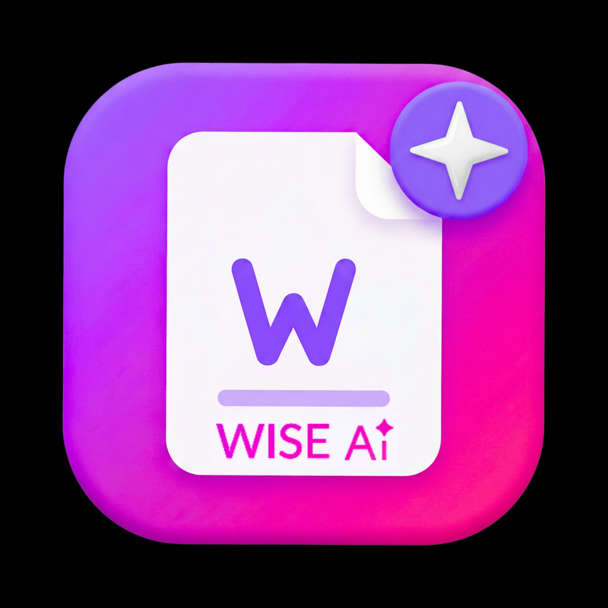

<div align="center">
  
  <h1>WiseResume</h1>
  <p><strong>The Elite AI-Powered Career Assistant & Resume Engine</strong></p>
  <p><em>Part of the Wise Universe</em></p>
</div>

---

**WiseResume** is not just another resume builder—it is an intelligent, agentic career hub. Designed for ambitious professionals, it leverages advanced multi-model AI to completely orchestrate the job application lifecycle: from resume generation and ATS (Applicant Tracking System) optimization, to hyper-realistic AI mock interviews and continuous career pathing.

Built with a premium, app-like mobile-first architecture, WiseResume delivers desktop-class power with native biometric security and offline resilience.

## 🌟 Why WiseResume is Different

Most resume tools just format text. WiseResume **understands your career** and **acts on your behalf**.

*   **🧠 Multi-Model AI Orchestration**: We don't rely on a single LLM. WiseResume intelligently routes tasks (like OCR, semantic gap analysis, or conversational interviewing) to the most capable AI models.
*   **🔒 Bring Your Own Key (BYOK)**: Full control over your AI usage and privacy. Bring your own OpenAI or Gemini keys, stored securely with encrypted standard vectors.
*   **📱 True Mobile-First with Biometrics**: Built on Capacitor, WiseResume isn't just responsive—it feels native. Secure your career data with FaceID/TouchID directly from the web or installed PWA.
*   **⚡ Offline-First Architecture**: Your career doesn't stop when you lose signal. Edit your resume, review guides, and queue applications entirely offline. Changes sync automatically when reconnected.

---

## 🚀 Core Capabilities

### 📄 Intelligent Document Generation
*   **Smart Parsing**: Upload an old PDF or provide a LinkedIn URL—WiseResume's OCR and semantic engines extract and structure your entire career history automatically.
*   **Contextual Tailoring**: Paste a job description and watch the AI completely rewrite your resume highlights to surgically match the ATS keywords and required skills.
*   **One-Page Optimizer**: Running out of space? The AI intelligently condenses your experience without losing impact, perfectly fitting stringent one-page requirements.
*   **Cover & Resignation Letters**: Generate perfectly toned, context-aware letters in seconds.

### 💼 Career "Agentic" Hub
*   **The Recruiter Simulator**: Don't guess if your resume is good. Run it against our AI Recruiter which simulates harsh ATS filtering and provides actionable, brutal feedback before you apply.
*   **Voice Mock Interviews**: Engage in real-time, two-way voice interviews with an AI hiring manager, complete with stutters, thinking time, and detailed post-interview feedback (powered by ElevenLabs).
*   **Agentic Career Chat**: A persistent AI advisor that knows your entire portfolio. Ask it "Am I qualified for a Senior React role?" and get an analysis based on your actual data.

### 🌐 Professional Presence
*   **Public Portfolios**: Instantly generate a stunning, responsive public portfolio link directly from your resume data. Track views and analytics.
*   **Application Tracker**: A built-in Kanban board to track your applications, interviews, and offers in one place.

---

## 🛠️ Technical Architecture

WiseResume is engineered for extreme performance and scalability. 

**The Stack:**
*   **Frontend**: React 18, TypeScript, Vite 5
*   **Styling**: Tailwind CSS 3, Radix UI (shadcn/ui), Framer Motion
*   **State & Data**: Zustand, TanStack Query (React Query)
*   **Backend & DB**: Supabase (Postgres, Auth, 30+ Edge Functions)
*   **Mobile / PWA**: Capacitor 8, `vite-plugin-pwa`
*   **Routing**: React Router DOM (Lazy-loading everything)

---

## 💻 Getting Started (Development)

### Prerequisites
*   Node.js 18+ or Bun
*   Supabase CLI (for local backend development)

### 1. Installation
Clone the repository and install dependencies:
```bash
git clone https://github.com/iammagdy/wiseresume1.git
cd wiseresume1
npm install
# or
bun install
```

### 2. Environment Setup
Copy the example environment file:
```bash
cp .env.example .env
```
Fill in your Supabase URL, Anon Key, and necessary AI API keys.

### 3. Run Development Server
```bash
npm run dev
# or
bun dev
```

---

## 📊 Performance & Optimization

WiseResume treats performance as a feature.

### Lighthouse Baseline
Run Lighthouse in Chrome DevTools → **Lighthouse** tab → select **Mobile**, check **Performance** + **Best Practices** → click **Analyze**. We target a 95+ score.

### React Profiling
1. Install the [React Developer Tools](https://react.dev/learn/react-developer-tools) browser extension.
2. Open **Profiler** tab → click **Record** → interact with the app.
3. Apply `React.memo`, `useMemo`, or `useCallback` to identified hot spots.

### Real Device & Throttling Testing
1. Find your machine's local IP (`ipconfig` / `ifconfig`).
2. Open `http://<your-ip>:8080` on your phone (same network).
3. In Chrome DevTools → **Network** tab → enable **Slow 3G**; → **Performance** tab → enable **4× CPU slowdown**.
4. Verify layout integrity, transition smoothness, and application responsiveness.

---

## 📜 License & Copyright

Copyright © Wise AI. All rights reserved. 
Unauthorized copying of this file, via any medium is strictly prohibited. Proprietary and confidential.
