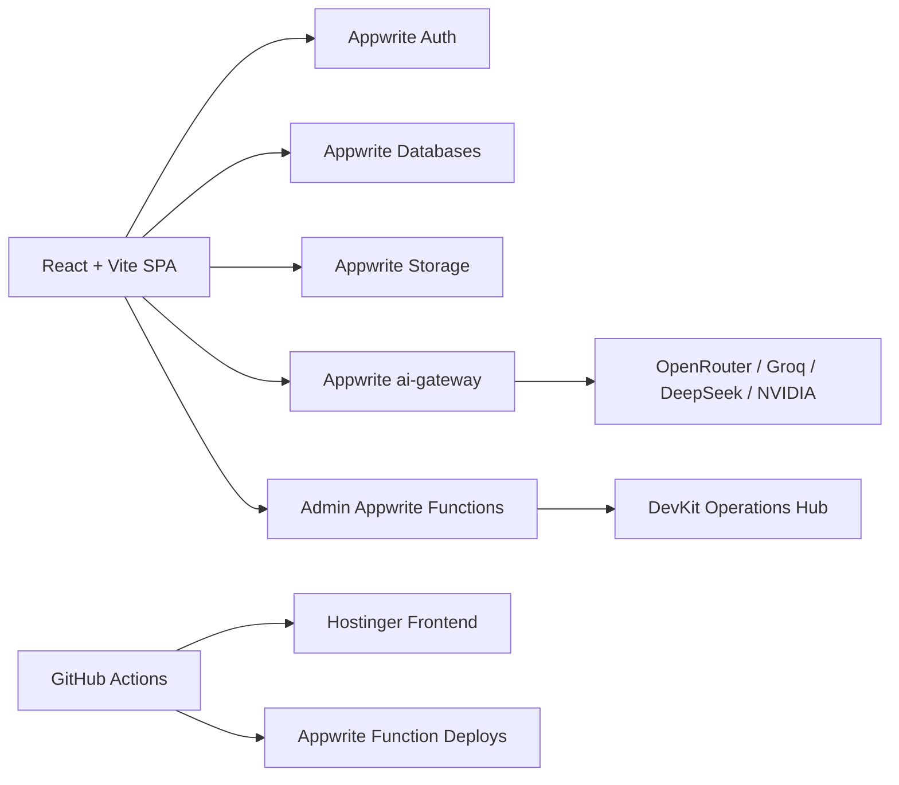

# WiseResume

<p align="center">
  <strong>The AI career operating system for job seekers, recruiters, and the teams running both.</strong>
</p>

<p align="center">
  <a href="https://resume.thewise.cloud">Production</a>
  |
  <a href="./Project%20Atlas/MASTER_HANDOVER_2026.md">Project Atlas</a>
  |
  <a href="./Project%20Atlas/DEPLOYMENT_GUIDE.md">Deployment Guide</a>
  |
  <a href="./Project%20Atlas/RULES.md">Agent Rules</a>
</p>

<p align="center">
  
  
  
  
  
</p>

---

## What This Is

WiseResume is a production SaaS platform for building, tailoring, analyzing, and publishing career assets with AI. The same codebase also powers WiseHire, an invite-only recruiter surface built on the shared Wise Cloud infrastructure.

This is not a static resume builder. It is an Appwrite-native product system with authenticated workspaces, AI routing, CV parsing, portfolio publishing, plan controls, admin operations, support tooling, and deployment automation.

## Product Surface

| Area | What it does |
|---|---|
| Resume Builder | Structured resume editing, section controls, templates, export flows, and portfolio publishing. |
| AI Studio | AI-assisted resume tailoring, rewriting, analysis, interview prep, and career workflows. |
| CV Import | PDF/DOCX extraction with browser-side parsing, OCR assets, and AI normalization through `ai-gateway`. |
| User Dashboard | Resumes, credits, plan state, onboarding, activity, and entry points into the product. |
| WiseHire | Recruiter-facing waitlist and talent workflows sharing the Wise Cloud foundation. |
| DevKit | Internal Operations Hub for diagnostics, users, email, traffic, feature control, audit, AI health, and support actions. |

## Architecture



| Layer | Stack |
|---|---|
| Frontend | React 18, TypeScript 5, Vite 6, Tailwind, Radix UI, shadcn/ui, Framer Motion |
| State | TanStack Query, Zustand, Appwrite Realtime where needed |
| Backend | Appwrite Auth, Databases, Storage, Functions |
| AI | Consolidated Appwrite `ai-gateway` with routed provider failover |
| Server | Express utility server for health and native PDF export |
| Deployment | GitHub Actions to Hostinger and Appwrite Cloud |

## Repository Map

```text
src/                         React app, pages, components, hooks, client libraries
appwrite-hubs/               Appwrite Function sources and admin hubs
server/                      Express utility server and PDF export endpoint
scripts/                     Build, deployment, parser asset, and verification helpers
.github/workflows/           Frontend and Appwrite hub deployment workflows
tests/                       Unit and E2E coverage
Project Atlas/               Canonical project truth, handovers, architecture, changelog
```

## Local Development

Requirements:

- Node.js 22 or newer
- npm
- Appwrite project access for live backend flows
- DevKit password only when testing `/devkit`

Install and run:

```bash
npm install
npm run dev
```

The dev script copies PDF.js and Tesseract assets before Vite starts. Use `http://localhost:5000` for local browser testing when the dev server is configured to that port.

## Core Commands

| Command | Purpose |
|---|---|
| `npm run dev` | Start local Vite development server after syncing parser assets. |
| `npm run build` | Typecheck, build production assets, and verify sourcemaps are not shipped. |
| `npm exec tsc -- --noEmit` | Fast TypeScript verification. |
| `npm test` | Run Vitest suite. |
| `npm run test:e2e` | Run Playwright Chromium E2E tests. |
| `node --check scripts/deploy_hubs.cjs` | Validate Appwrite hub deploy script syntax. |

## Environment

Production truth lives in Appwrite Cloud and GitHub Actions secrets. Do not commit secrets.

Common local variables:

```bash
VITE_APPWRITE_ENDPOINT=https://fra.cloud.appwrite.io/v1
VITE_APPWRITE_PROJECT_ID=69fd362b001eb325a192
```

Deployment-sensitive variables are documented in:

- [`Project Atlas/DEPLOYMENT_GUIDE.md`](./Project%20Atlas/DEPLOYMENT_GUIDE.md)
- [`Project Atlas/MASTER_HANDOVER_2026.md`](./Project%20Atlas/MASTER_HANDOVER_2026.md)

## Deployment

WiseResume production is served from:

- Frontend: Hostinger, `resume/` target
- Backend: Appwrite Cloud Functions
- Production URL: <https://resume.thewise.cloud>

Before touching workflows, FTP config, function deployment, or domain routing, read:

```text
Project Atlas/DEPLOYMENT_GUIDE.md
Project Atlas/RULES.md
```

## AI Agent Rules

`Project Atlas/` is the only documentation source of truth. Every significant change must update the relevant Atlas file and `Project Atlas/CHANGELOG.md`.

Do not guess root causes. Verify through code, logs, Appwrite state, or browser behavior before fixing.

Start here:

- [`Project Atlas/RULES.md`](./Project%20Atlas/RULES.md)
- [`Project Atlas/MASTER_HANDOVER_2026.md`](./Project%20Atlas/MASTER_HANDOVER_2026.md)
- [`Project Atlas/01-Currently Implemented/README.md`](./Project%20Atlas/01-Currently%20Implemented/README.md)

## Status

The app is Appwrite-native for auth, database, storage, AI routing, and admin operations. The current engineering focus is keeping DevKit fully functional, keeping upload/parsing reliable across browsers and devices, and preserving Atlas as the single source of truth.

---

<p align="center">
  Built for serious career workflows. Operated like a real SaaS.
</p>
